# Via Audit — Sistema de Auditoria de Comodato

<p align="center">
  
  
  
  
  
  
  
</p>

---

## 📌 Sobre o Projeto

O **Via Audit** é uma solução completa (Mobile App + API REST + SDD Kit) desenvolvida para a **auditoria de comodato de equipamentos educacionais**. 

O sistema permite a verificação, registro, foto-documentação, localização geográfica e coleta de assinatura digital de gestores escolares durante a auditoria de inventário de equipamentos cedidos em regime de comodato.

---

## 🌟 Principais Funcionalidades

### 📱 Aplicativo Mobile (Flutter)
- **🔐 Autenticação & Sessão:** Login seguro de auditores com armazenamento de token via `flutter_secure_storage`.
- **🏫 Seleção de Escolas:** Navegação e seleção de instituições atreladas ao escopo de auditoria.
- **📋 Checklist Interativo:** Interface responsiva para conferência de estado e presença de equipamentos.
- **📦 Cadastro de Equipamentos & Fotos:** Captura de fotos via câmera (`image_picker`) e registro geográfico (`geolocator`).
- **✍️ Assinatura Digital:** Coleta direta da assinatura do responsável da escola na tela final (`signature`).
- **🔄 Arquitetura Offline-First:** Persistência local utilizando SQLite (`sqflite`) e sincronização reativa via `Provider` e `Dio`.
- **🎨 Design System:** Interface moderna baseada em **Material Design 3**, adaptável para **Android, iOS e Windows**.

### 🖥️ REST API Backend (Node.js & Express)
- **🚀 API RESTful Modular:** Endpoints estruturados por módulos (`auth`, `audit`, `schools`, `items`, `summary`).
- **🗄️ Persistência de Dados:** Integração nativa com **MySQL** (`mysql2`).
- **📁 Upload de Mídias:** Armazenamento seguro de fotos e assinaturas digitais via `multer`.
- **⚡ Ambientes Configuráveis:** Controle via variáveis de ambiente (`.env`).

### ⚙️ Spec-Driven Development (SDD Kit)
- **🤖 12 Agentes Especializados:** Agentes integrados para auxílio no raciocínio arquitetural, frontend, backend e QA.
- **📋 Pipeline Brief → Specs → Código:** Metodologia orientada a especificações para evolução previsível do produto.

---

## 🏗️ Arquitetura do Sistema

```mermaid
graph TD
    subgraph Client ["📱 Aplicativo Mobile (Flutter)"]
        UI["UI / Screens (Material 3)"]
        State["State Management (Provider)"]
        LocalDB[("Local DB (SQLite)")]
        UI --> State
        State <--> LocalDB
    end

    subgraph Server ["🖥️ Backend (Node.js + Express)"]
        API["Express API Server"]
        AuthMiddleware["Auth Middleware"]
        Multer["Multer (Storage)"]
        API --> AuthMiddleware
        API --> Multer
    end

    subgraph Storage ["🗄️ Infraestrutura"]
        MySQL[("Database (MySQL)")]
        Uploads["/uploads (Imagens & Assinaturas)"]
    end

    State <-->|HTTP / JSON REST| API
    API <--> MySQL
    Multer --> Uploads
```



---

## 📂 Estrutura de Pastas

```
via-audit/
├── via_audit/                 # 📱 Aplicativo Mobile em Flutter
│   ├── lib/
│   │   ├── app/               # Rotas e configurações globais
│   │   ├── core/              # Temas (MD3), widgets genéricos e utilitários
│   │   └── features/          # Módulos por funcionalidade (audit, auth, checklist, etc.)
│   ├── test/                  # Testes unitários e de componentes
│   └── pubspec.yaml           # Dependências do Flutter
│
├── via-audit-api/             # 🖥️ REST API Backend em Node.js
│   ├── src/
│   │   ├── config/            # Configurações de banco de dados e ambiente
│   │   ├── database/          # Migrations e scripts de seed
│   │   ├── middlewares/       # Middlewares de autenticação e validação
│   │   └── modules/           # Controllers e serviços por módulo
│   ├── uploads/               # Armazenamento de arquivos e fotos de auditoria
│   └── package.json           # Dependências do Node.js
│
├── specs/                     # 📋 Especificações técnicas (SDD Kit)
│   ├── _gerador/              # Pipeline e motor genérico de geração de specs
│   ├── discovery/             # Documentação técnica do projeto
│   └── features/              # Especificações de funcionalidades
│
├── .claude/                   # 🤖 Agentes e comandos customizados para Claude Code
├── scripts/                   # 🛠️ Scripts auxiliares (sdd-lint, etc.)
├── SETUP.md                   # 📖 Guia de instalação do SDD Kit
├── LICENSE                    # 📄 Licença MIT
└── README.md                  # 📄 Este arquivo de documentação
```

---

## 🚀 Como Executar o Projeto

### Pré-requisitos
- **Flutter SDK**: `>= 3.12.0` ([Instruções de instalação](https://flutter.dev/docs/get-started/install))
- **Node.js**: `>= 18.0.0` ([Download Node.js](https://nodejs.org/))
- **MySQL Server**: `>= 8.0` rodando localmente ou via Docker.

---

### 1️⃣ Executando o Backend (Node.js API)

1. Navegue até a pasta da API:
   ```bash
   cd via-audit-api
   ```

2. Instale as dependências:
   ```bash
   npm install
   ```

3. Configure as variáveis de ambiente:
   ```bash
   cp .env.example .env
   ```
   *Edite o arquivo `.env` com suas credenciais do MySQL e porta desejada.*

4. Popule o banco de dados inicial (Seed):
   ```bash
   npm run seed
   ```

5. Inicie o servidor em modo de desenvolvimento:
   ```bash
   npm run dev
   ```
   > A API estará rodando em `http://localhost:3000` (ou na porta configurada).

---

### 2️⃣ Executando o Aplicativo Mobile (Flutter)

1. Navegue até a pasta do aplicativo mobile:
   ```bash
   cd via_audit
   ```

2. Obtenha as dependências do Flutter:
   ```bash
   flutter pub get
   ```

3. Verifique os dispositivos disponíveis:
   ```bash
   flutter devices
   ```

4. Execute o aplicativo:
   ```bash
   flutter run
   ```
   *(Substitua pelo seu dispositivo alvo: Android, iOS, Windows ou Chrome).*

---

## 🛠️ Comandos do SDD Kit (Spec-Driven Development)

Este projeto utiliza a metodologia SDD. Os seguintes comandos estão disponíveis para uso via assistente:

| Comando | Descrição |
| :--- | :--- |
| `/sdd-init` | Bootstrap e verificação da estrutura do projeto |
| `/sdd-status` | Exibe o dashboard de specs e pendências |
| `/nova-spec` | Cria uma nova spec a partir dos templates do projeto |
| `/gerar-projeto` | Executa o pipeline completo a partir de um brief |
| `/implementar-spec` | Implementa uma spec de ponta a ponta |
| `/implementar-tarefa` | Implementa uma tarefa específica (`T-XXX`) |

---

## 📄 Licença

Este projeto está licenciado sob a Licença **MIT** — consulte o arquivo [LICENSE](LICENSE) para mais detalhes.

---

<p align="center">
  Desenvolvido com ❤️ por <b>Eduardo Martins</b> para a <b>Via Educat</b>.
</p>
