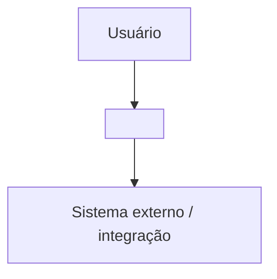
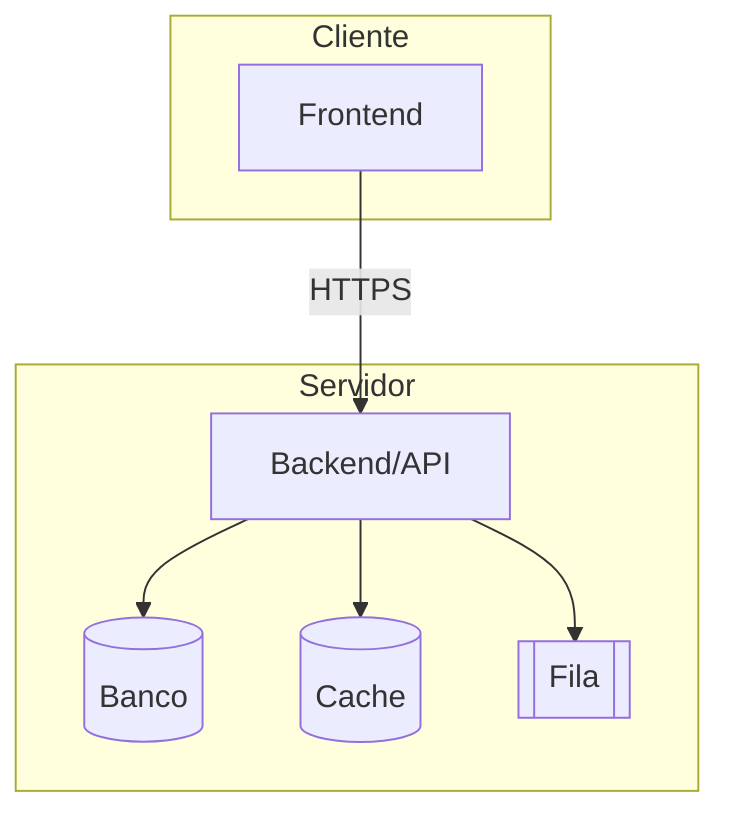

# Arquitetura da Solução — <Nome>

> Artefato de **discovery** (Bloco 3). Segue o **C4 Model** (Contexto → Contêineres → Componentes).
> Decisões arquiteturais concretas (monolito×microserviços, REST×GraphQL, SQL×NoSQL) que fecharem
> aqui devem gerar um **ADR** em `specs/decisions/` e, se virarem regra, entrar no `sdd.config.md`.

## Nível 1 — Contexto
> Sistema no centro, atores e sistemas externos ao redor.

## Nível 2 — Contêineres
> Apps, APIs, bancos, filas, cache, storage — como o sistema se divide em unidades executáveis.

## Nível 3 — Componentes (por contêiner relevante)
> Módulos internos de um contêiner. Detalhe só os que têm complexidade real.

## Decisões arquiteturais (resumo → viram ADRs)
| Tema | Decisão | ADR |
|------|---------|-----|
| Estilo | <monolito / microserviços / modular monolith> | ADR-NNN |
| API | <REST / GraphQL / gRPC> | ADR-NNN |
| Persistência | <SQL / NoSQL / híbrido> | ADR-NNN |
| Mensageria | <fila / eventos / n/a> | ADR-NNN |
| Cache | <estratégia / n/a> | ADR-NNN |
| Autenticação | <ex.: OAuth2/OIDC, sessão> | ADR-NNN |

## Requisitos transversais atendidos
> Como a arquitetura endereça os RNF (segurança, escala, disponibilidade, observabilidade).

## 📅 Histórico
| Data | Versão | Mudança |
|------|--------|---------|
| AAAA-MM-DD | 0.1.0 | Versão inicial (discovery) |
