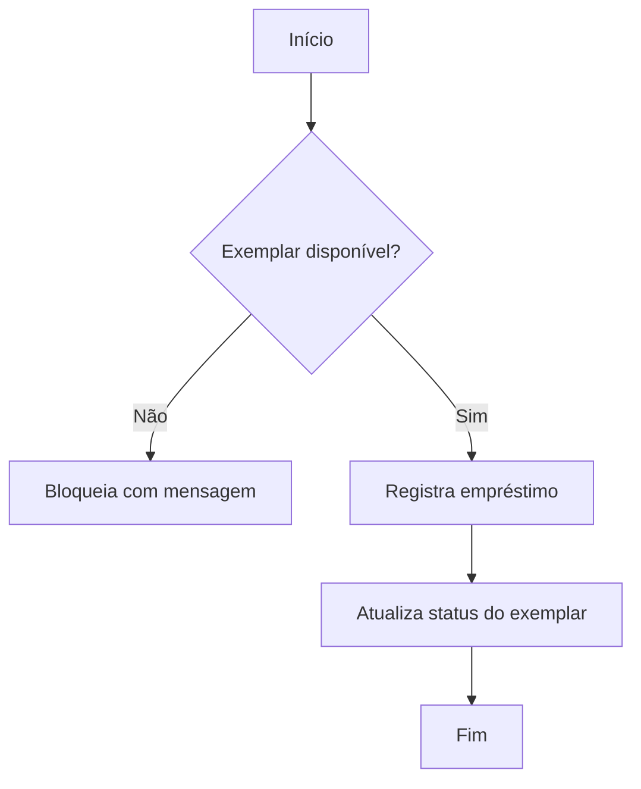

# Fluxos de Negócio — <Nome>

> Artefato de **discovery** (Bloco 1). Um diagrama por fluxo principal. Use Mermaid para versionar
> junto do código. Cada caminho feliz vira base de CAs e de testes e2e.

## Fluxo 1 — <ex.: Empréstimo de livro>
> <descrição em uma frase>

- **Atores:** <quem participa>
- **Pré-condições:** <estado necessário antes>
- **Pós-condições:** <estado resultante>
- **Exceções:** <caminhos alternativos / erros>

## Fluxo 2 — <nome>
> Repita o bloco acima por fluxo.

## Casos de uso (resumo)
| UC | Ator | Objetivo | Fluxo relacionado |
|----|------|----------|-------------------|
| UC-01 | <ator> | <objetivo> | Fluxo 1 |

## 📅 Histórico
| Data | Versão | Mudança |
|------|--------|---------|
| AAAA-MM-DD | 0.1.0 | Versão inicial (discovery) |
