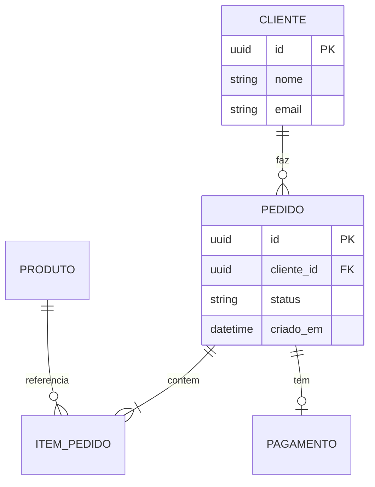
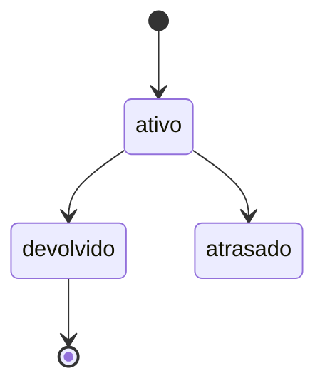

# Modelo de Dados — <Nome>

> Artefato de **discovery** (Bloco 2). Define entidades, relacionamentos e regras **antes** do
> banco. Os tipos concretos derivados daqui viram os contratos (config seção 5, camada 1).

## Entidades e relacionamentos (DER)

## Dicionário de entidades
### <Entidade>
| Campo | Tipo | Regras | Observações |
|-------|------|--------|-------------|
| id | uuid | PK | — |
| <campo> | <tipo> | <único / obrigatório / enum...> | <nota> |

## Regras de integridade e invariantes
- <ex.: ISBN único no acervo>
- <ex.: pedido `pago` é terminal — não reabre>
- <ex.: item de pedido não existe sem pedido pai>

## Estados (máquinas de estado)
> Para entidades com ciclo de vida, liste estados e transições; **marque terminais**.

## 📅 Histórico
| Data | Versão | Mudança |
|------|--------|---------|
| AAAA-MM-DD | 0.1.0 | Versão inicial (discovery) |
