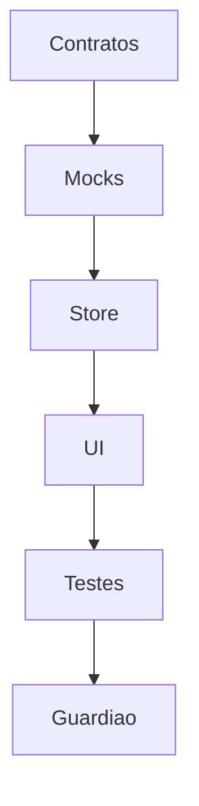

# <PREFIXO>NNN: Plano — <Título>

## 🧭 Contexto resumido
> Um parágrafo. Executa a spec `<PREFIXO>NNN`. Objetivo: entregar <X>.

## ✅ Pré-requisitos
- [ ] <bloqueador que precisa estar resolvido antes de iniciar>

## 📅 Fases de trabalho

> Espelhe as **camadas de implementação** do `sdd.config.md` (seção 5).

### Fase 1 — Contratos
- **Objetivo:** tipos compartilhados no lugar declarado na config.
- **Pronto quando:** typecheck verde; literais para gates; `Patch` omite imutáveis.

### Fase 2 — Mocks
- **Pronto quando:** ≥5 itens cobrindo todos os estados; sem relógio real.

### Fase 3 — Estado/store + invariantes
- **Pronto quando:** gate na store, escopo em todo getter/escrita, estados terminais,
  invariantes provando ausência do caminho proibido.

### Fase 4 — UI + rotas + menu (se houver UI)
- **Pronto quando:** telas + rota + **entrada no menu** (config seção 3).

### Fase 5 — Testes
- **Pronto quando:** 1 teste por CA + 1 invariante por regra crítica; e2e do caminho feliz.

### Fase 6 — Guardião
- **Pronto quando:** `@agente-spec-guardian` aprova; greps de ausência = 0.

## 🔗 Dependências

## 🎯 Critérios de saída
- [ ] Suíte verde (comandos da config seção 2)
- [ ] Cada CA coberto por teste
- [ ] Spec marcada como `implementada`
- [ ] LEDGER atualizado
