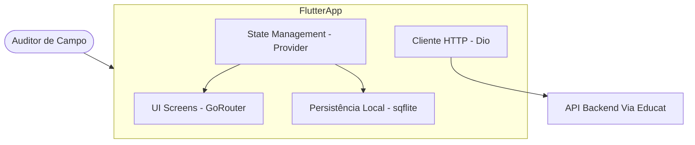

# Arquitetura `[código]`

## C4 Diagram — Nível de Contêiner / Componentes

## Decisões de Arquitetura Identificadas `[código]`
1. **Flutter + Dart SDK 3.12+:** Aplicação mobile multiplataforma (Android/iOS/Windows).
2. **Gerenciamento de Estado com `provider`:** Centralização do estado de auditoria no `AuditProvider`.
3. **Roteamento Declarativo com `go_router`:** Rotas fortemente tipadas e simples para fluxo de navegação mobile.
4. **Clean Architecture por Features:** Estrutura modular (`lib/features/{auth,schools,checklist,item_register,summary,audit}`).
5. **Componentes de Design do Core (`lib/core/widgets`):** Widgets reutilizáveis como `MpCard`, `MpButton`, `MpBadge`, `MpProgressBar`, `MpKpiCard`, `MpChecklistItem`, `MpActionButton`.
