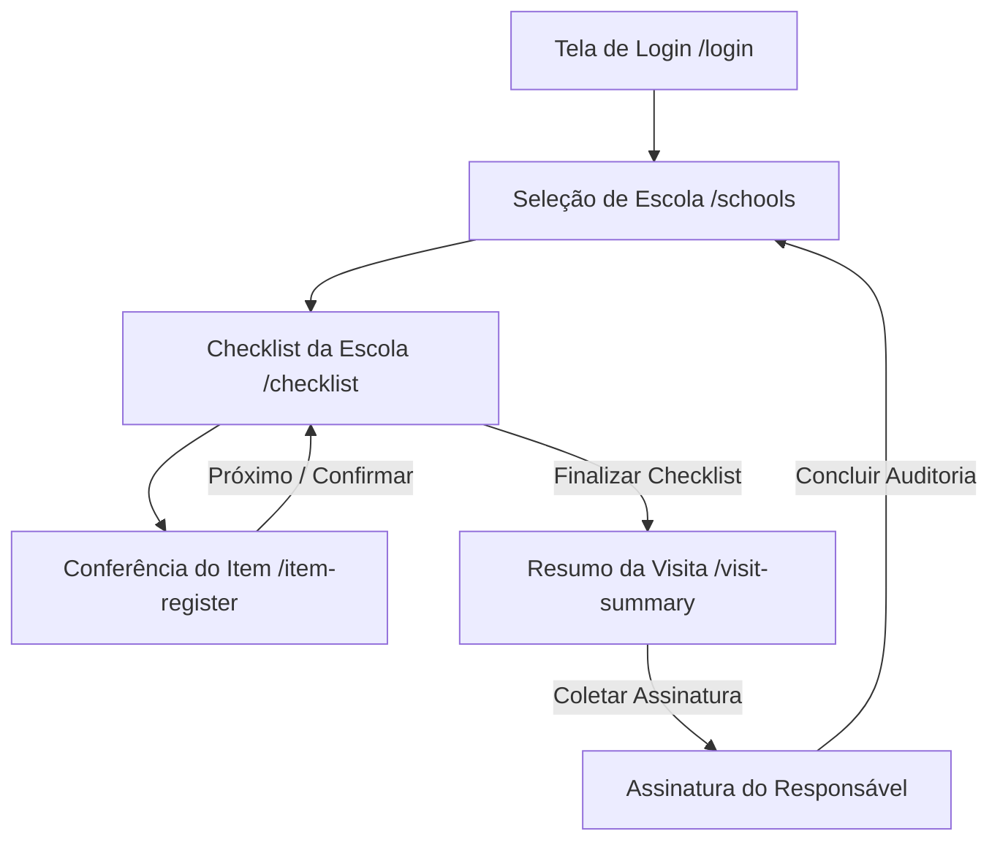

# Fluxos de Usuário `[código]`

## Fluxo Principal de Auditoria
1. **Login:** Auditor autentica no app (`LoginScreen`).
2. **Seleção:** Seleciona a escola agendada no mapa/lista (`SchoolListScreen`).
3. **Checklist:** Visualiza a lista de itens vinculados ao contrato de comodato (`ChecklistScreen`).
4. **Item:** Seleciona item, lê/insere o código de patrimônio, registra fotos/observações e define o status (`ItemRegisterScreen`).
5. **Encerramento:** Confere os indicadores da visita, coleta a assinatura na tela (`VisitSummaryScreen`) e conclui a visita.
