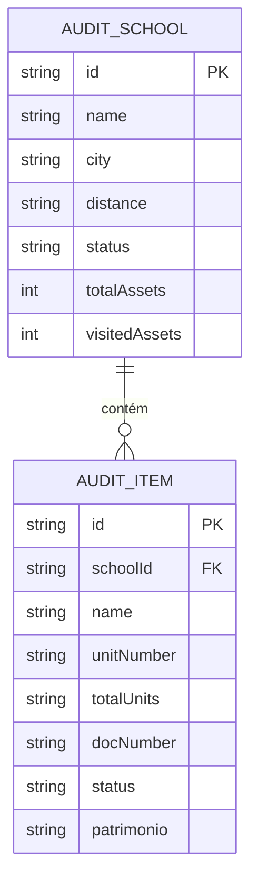

# Modelo de Dados `[código]`

## Diagrama Entidade-Relacionamento (DER)

## Entidades e Atributos

### `AuditSchool` `[código]`
- `id`: Identificador único da escola (`String`).
- `name`: Nome da instituição de ensino (`String`).
- `city`: Cidade / UF (`String`).
- `distance`: Distância estimada do auditor (`String`).
- `status`: Estado da visita (`scheduled`, `pending`, `completed`).
- `totalAssets`: Total de ativos previstos em contrato (`int`).
- `visitedAssets`: Total de ativos auditados (`int`).

### `AuditItem` `[código]`
- `id`: Identificador único do item (`String`).
- `name`: Descrição/Nome do equipamento (`String`).
- `unitNumber`: Número sequencial do lote (`String`).
- `totalUnits`: Total do lote (`String`).
- `docNumber`: Número da Nota Fiscal / Termo (`String`).
- `status`: Status do item (`done`, `miss`, `pending`, `active`, `warn`, `extra`).
- `patrimonio`: Código da etiqueta patrimonial (`String`).
